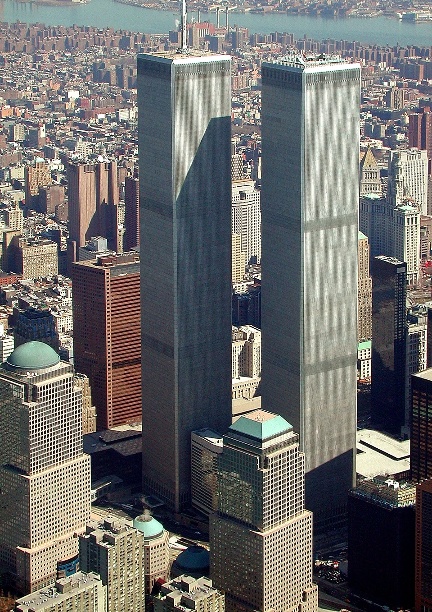

# 🏛️ Echoes of Time

### A Historical Digital Museum — September 11, 2001

> **Echoes of Time** is an interactive historical website created as a digital museum, designed to present historical information, people, artifacts, and the lasting legacy of September 11, 2001.

---

## ✨ About the Project

**Echoes of Time** is a multi-page historical website that explores the events surrounding September 11, 2001 through a museum-inspired digital experience.

Instead of presenting information as a simple collection of pages, the project uses a dark, elegant visual design to create the feeling of walking through a digital historical exhibition.

The website is organized into four main sections:

* 🕰️ **Origins** — historical background and timeline
* 👥 **Figures** — people and groups connected to the events
* 🏺 **Artifacts** — objects and materials preserved from the period
* 🕊️ **Legacy** — remembrance, memorials, museums, and historical impact

The goal is to combine **HTML structure, CSS design, multimedia, accessibility, and historical storytelling** into one complete web project.

---

## 🗂️ Website Structure

```text
EchoesOfTime/
│
├── origins.html
├── figures.html
├── artifacts.html
├── legacy.html
│
├── css/
│   └── style.css
│
├── images/
│   ├── world-trade-center.jpg
│   ├── new-york-skyline.jpg
│   ├── people-01.jpg
│   ├── people-02.jpg
│   ├── people-03.jpg
│   ├── people-04.jpg
│   ├── artifact-01.jpg
│   ├── artifact-02.jpg
│   ├── artifact-03.jpg
│   ├── artifact-04.jpg
│   ├── memorial-01.jpg
│   ├── memorial-02.jpg
│   └── memorial-03.jpg
│
└── README.md
```

---

## 🎨 Design

The website was designed with a **digital museum aesthetic**.

### Visual concept

* 🌑 Dark historical atmosphere
* 🏛️ Museum-inspired layouts
* ✨ Glass-effect cards
* 📜 Elegant typography
* 🖼️ Historical image galleries
* 🧭 Internal navigation
* 📱 Responsive design for different screen sizes
* 🎞️ Subtle animations and hover effects

The color palette was intentionally kept dark and restrained to create a serious historical atmosphere while keeping the content readable.

---

## 🧩 Technologies

This project was built using:

| Technology        | Purpose                                       |
| ----------------- | --------------------------------------------- |
| **HTML5**         | Website structure and semantic content        |
| **CSS3**          | Design, layout, animations and responsiveness |
| **Google Fonts**  | Typography                                    |
| **Semantic HTML** | Meaningful and accessible page structure      |

---

## 📚 Pages

### 🕰️ Origins

`origins.html`

Introduces the historical background and provides a timeline that helps visitors understand the context leading up to September 11, 2001.

---

### 👥 Figures

`figures.html`

Focuses on the people and groups connected to the events, including first responders, passengers, crew members, and others whose experiences became part of the historical record.

---

### 🏺 Artifacts

`artifacts.html`

Presents physical objects and preserved materials connected to the events and explains how historical objects can help document and understand the past.

---

### 🕊️ Legacy

`legacy.html`

Explores remembrance, memorial spaces, museums, and the long-term historical impact of September 11.

---

## 🔎 Interactive Features

The website includes several interactive and navigational elements:

* 🔗 Navigation between all four pages
* ⚓ Internal anchor links
* 📖 Expandable `<details>` sections
* 🖼️ Image galleries
* 💬 Historical blockquotes
* 📊 Historical timeline
* 🔗 External historical resources
* 🏷️ Image captions using `<figcaption>`

---

## ♿ Semantic HTML

The project uses semantic HTML5 elements to create a clear and meaningful structure.

Examples include:

```html
<header>
<nav>
<main>
<section>
<article>
<aside>
<figure>
<figcaption>
<footer>
```

This helps organize the content and improves readability, accessibility, and maintainability.

---

## 🖼️ Media

The website uses historical imagery throughout the different sections.

Images are organized inside:

```text
images/
```

Each image is referenced using relative paths, for example:

```html

```

---

## 🚀 How to Run the Project

No server or database is required.

Simply open:

```text
origins.html
```

in a web browser.

You can then navigate through the other pages using the website navigation menu.

---

## 💻 Run with VS Code

If you are using **Visual Studio Code**, you can also use the **Live Server** extension.

1. Open the `EchoesOfTime` folder in VS Code.
2. Open `origins.html`.
3. Right-click the file.
4. Select **Open with Live Server**.
5. The website will open in your browser.

---

## 📌 Project Goals

This project demonstrates the ability to:

* Build a multi-page website
* Connect multiple HTML pages
* Use semantic HTML5
* Create responsive layouts
* Work with images and media
* Create internal and external links
* Design a consistent visual system
* Organize files and folders professionally
* Use Git and GitHub for version control

---

## 🌐 GitHub

This project is maintained using Git for version control and GitHub for remote source-code management.

### Clone the repository

```bash
git clone https://github.com/EstherLogic/EchoesOfTime.git
```

Then:

```bash
cd EchoesOfTime
```

Open the project in your preferred code editor.

---

## 📸 Project Preview

### Origins

Historical background, timeline and contextual information.

### Figures

A visual presentation of the people and groups connected to the historical events.

### Artifacts

A digital collection presenting preserved objects and historical materials.

### Legacy

A section dedicated to remembrance, memorials and historical impact.

---

## 🏛️ A Digital Museum

**Echoes of Time** was created to demonstrate how web technology can transform historical information into an interactive digital experience.

The project combines **storytelling, visual design and web development** to create a website that feels more like an online museum than a traditional school webpage.

---

## 👩‍💻 Author

**Esther Peretz**

Computer Science & Programming Student

GitHub: **EstherLogic**

---

## ⭐ Project

**Echoes of Time — A History Website**

> *Remember the history. Preserve the stories. Explore the echoes of time.*

---
